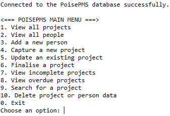
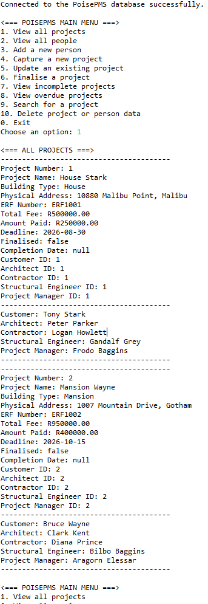
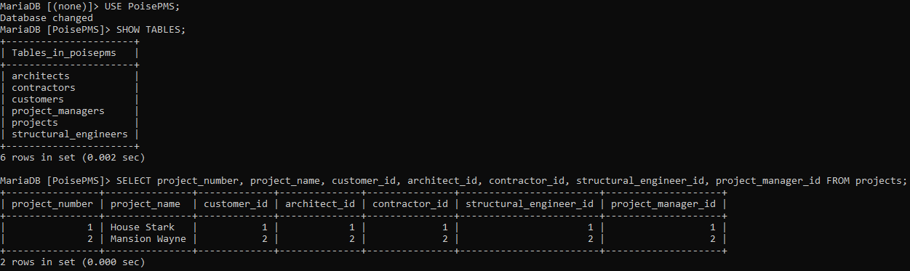

# PoisePMS

PoisePMS is a Java console application for managing construction projects and the people linked to those projects.

The application uses JDBC to connect to a MariaDB database. Project data, customer data and contractor-related data are stored in relational database tables instead of text files.

This project was built as a Java database programming capstone and has been prepared as part of my developer portfolio to demonstrate Java, SQL, JDBC, relational database design and clean project documentation.

## Features

- View all projects
- View all people linked to projects
- Add new people
- Capture new projects
- Update existing project details
- Finalise projects with a completion date
- View incomplete projects
- View overdue projects
- Search for projects by project number or project name
- Delete project and person records
- Display linked project, customer, architect, contractor, engineer and manager data

## Screenshots

### Main Menu



### View All Projects



### Database Tables



## Technologies Used

- Java
- JDBC
- MariaDB
- SQL
- Eclipse IDE
- Javadoc
- Git and GitHub

## Database Design

The project uses one main `projects` table and five supporting people tables.

```text
customers
architects
contractors
structural_engineers
project_managers
projects
```

The `projects` table links to the other tables using foreign keys.

```text
projects.customer_id              -> customers.customer_id
projects.architect_id             -> architects.architect_id
projects.contractor_id            -> contractors.contractor_id
projects.structural_engineer_id   -> structural_engineers.structural_engineer_id
projects.project_manager_id       -> project_managers.project_manager_id
```

## Project Structure

```text
poise-pms-java-sql/
├── database/
│   ├── schema.sql
│   └── seed.sql
├── doc/
├── lib/
│   └── mariadb-java-client-3.5.8.jar
├── src/
│   └── poisepms/
│       ├── DatabaseManager.java
│       ├── InputHelper.java
│       ├── PersonService.java
│       ├── PoisePMS.java
│       └── ProjectService.java
├── .classpath
├── .gitignore
├── .project
└── README.md
```

## Main Java Files

| File | Purpose |
|---|---|
| `PoisePMS.java` | Runs the main menu and controls the program flow. |
| `DatabaseManager.java` | Handles database connection details and creates JDBC connections. |
| `InputHelper.java` | Handles safe console input for text, numbers, money values and dates. |
| `PersonService.java` | Handles people-related database actions such as viewing, adding and deleting people. |
| `ProjectService.java` | Handles project-related database actions such as viewing, capturing, updating, finalising, searching and deleting projects. |

## Database Setup

Make sure MariaDB is installed and running.

Open MariaDB and run the schema file:

```sql
SOURCE C:/path/to/poise-pms-java-sql/database/schema.sql;
```

Then run the seed file:

```sql
SOURCE C:/path/to/poise-pms-java-sql/database/seed.sql;
```

For example, on my local machine:

```sql
SOURCE C:/Users/Mark Mottian/Desktop/Developer Portfolio Selected Work/PoisePMS/poise-pms-java-sql/database/schema.sql;
SOURCE C:/Users/Mark Mottian/Desktop/Developer Portfolio Selected Work/PoisePMS/poise-pms-java-sql/database/seed.sql;
```

The schema file creates the `PoisePMS` database and all required tables.

The seed file adds sample project and people data so the application can be tested immediately.

## Docker MariaDB Setup

This project includes a `docker-compose.yml` file for running MariaDB in Docker.

This is useful if you want to test the database setup without using a manually installed local MariaDB server.

Start the MariaDB container:

```powershell
docker compose up -d

## Database Configuration

The application reads database connection details from environment variables first.

```text
POISEPMS_DB_URL
POISEPMS_DB_USER
POISEPMS_DB_PASSWORD
```

If no environment variables are provided, the app uses these local defaults:

```text
jdbc:mariadb://localhost:3306/PoisePMS
root
password123
```

Update your environment variables or local defaults if your MariaDB details are different.

## How to Run the App

1. Open Eclipse.
2. Import the project as an existing Java project.
3. Make sure MariaDB is running.
4. Run `database/schema.sql`.
5. Run `database/seed.sql`.
6. Open `src/poisepms/PoisePMS.java`.
7. Run `PoisePMS.java` as a Java application.

If the connection works, the console should show:

```text
Connected to the PoisePMS database successfully.

<=== POISEPMS MAIN MENU ===>
```

## Javadoc Documentation

Javadoc documentation has been generated in the `doc` folder.

Open this file in a browser:

```text
doc/index.html
```

## What This Project Demonstrates

This project demonstrates my ability to:

- Build a Java console application with a clear menu flow
- Connect Java to a relational database using JDBC
- Design and use relational tables with primary keys and foreign keys
- Perform CRUD operations with SQL
- Use prepared statements for safer database operations
- Separate code into focused service classes
- Handle user input safely
- Document code with Javadoc
- Prepare a project for GitHub with database setup files and clear run instructions

## Author

Created by Mark Mottian as part of a Java Database Programming Capstone Project.
